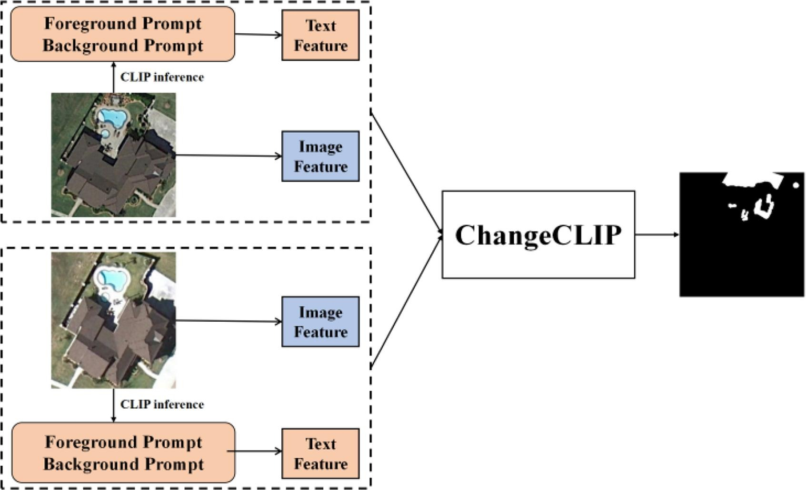
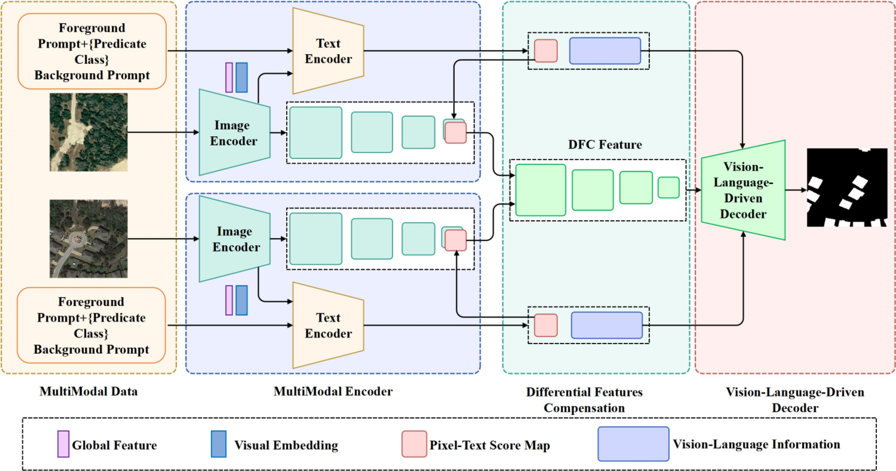
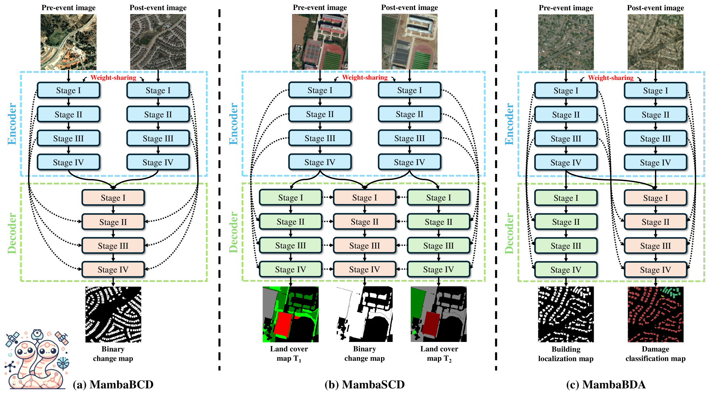
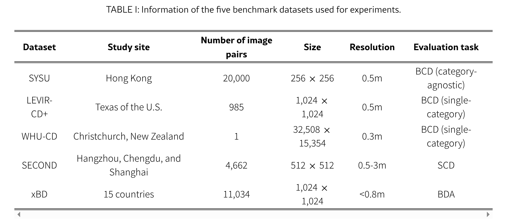
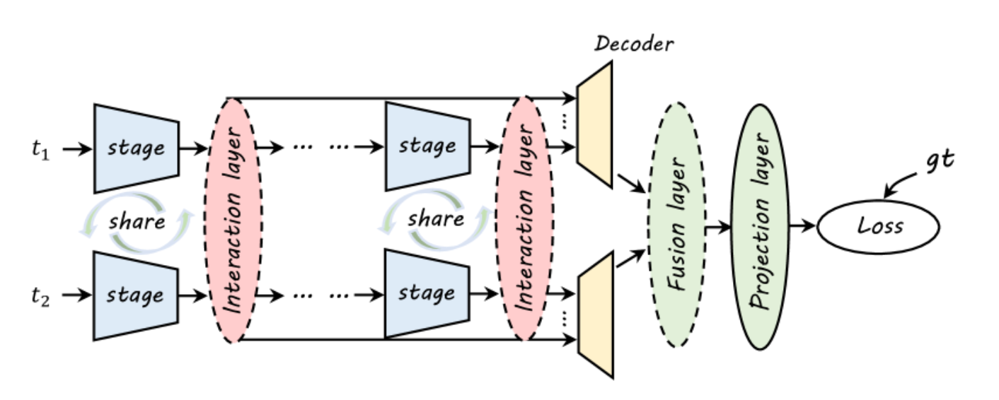
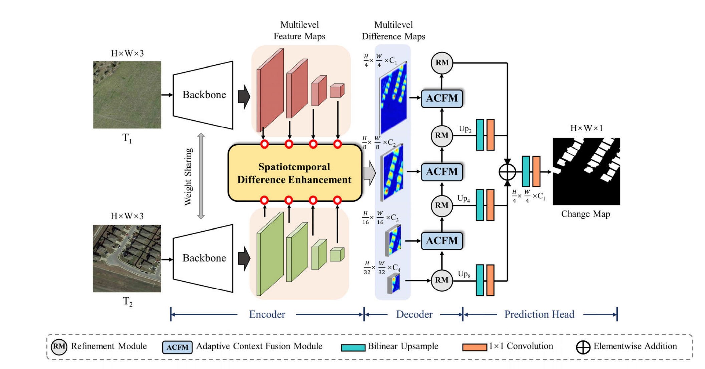
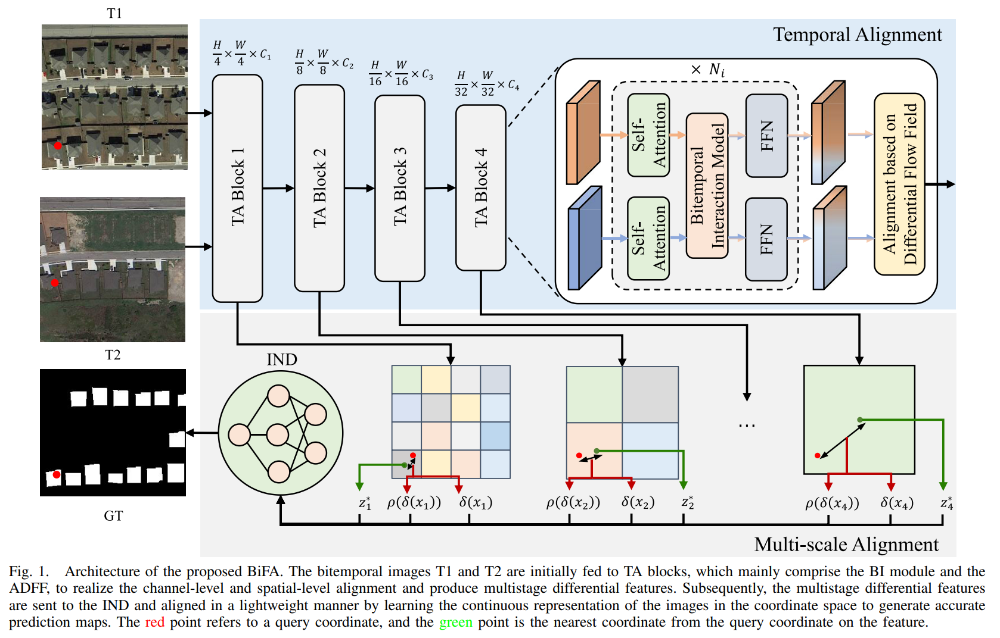

## 1. ChangeCLIP

**论文**：[ChangeCLIP: Remote sensing change detection with multimodal vision-language representation learning](https://www.sciencedirect.com/science/article/pii/S0924271624000042)

**问题**：传统深度学习方法更注重视觉表征学习，忽视了多模态数据的潜力。

**解决**：以 [CLIP](https://www.zhihu.com/tardis/zm/art/662365120?source_id=1003) 模型为基础，设计了遥感图像变化前后特征的具体提示。因此，这种方法能够构建一个富含多模先验的基础数据集，用于变化检测任务。

**数据集**：LEVIR-CD, LEVIR-CD+, WHUCD, CDD, SYSU-CD 

**代码**：<https://github.com/dyzy41/ChangeCLIP>

## 2. ChangeMamba

**论文**：[ChangeMamba: Remote Sensing Change Detection with Spatio-Temporal State Space Model](https://arxiv.org/abs/2404.03425)

**问题**：传统 CNN 和 Transformer 用于 CD，但 CNN 受限于有限的感受野，无法捕捉像素间的长距离依赖性，使其在处理具有不同时空分辨率的复杂多时空场景时仍然难以做到；而 Transformers 计算量大，复杂度为$O(n^2)$，使其在大数据集上的训练和部署成本较高。

> CD tasks can be categorized into three types, namely binary CD (BCD), semantic CD (SCD), and building damage assessment (BDA)

**解决**：尝试将 [Mamba](https://www.ibm.com/cn-zh/think/topics/mamba-model) 架构应用于 CD 任务，并提出了若干时空状态空间模型（统称为 ChangeMamba）。ChangeMamba 基于最近提出的 [VMamba](https://blog.csdn.net/soaring_casia/article/details/136052041#:~:text=%E2%97%8FVMamba%EF%BC%8C%E4%B8%80%E7%A7%8D%E8%A7%86%E8%A7%89,CNN%E5%92%8CViT%E7%9A%84%E6%89%A9%E5%B1%95%E3%80%82&text=%E5%BC%95%E5%85%A5%E4%BA%86%E4%BA%A4%E5%8F%89%E6%89%AB%E6%8F%8F%E6%A8%A1%E5%9D%97%EF%BC%88CSM%EF%BC%89%EF%BC%8C%E8%A7%A3%E5%86%B3%E4%BA%861,%E5%85%A8%E5%B1%80%E6%84%9F%E5%8F%97%E9%87%8E%E7%9A%84%E7%89%B9%E6%80%A7%E3%80%82) 架构，该架构采用交叉扫描模块（CSM），能够向不同空间方向展开图像补丁，从而从图像中有效建模全局上下文信息。由于 CD 任务要求探测器从多时态图像中充分学习时空特征，我们设计了三种时空-时间关系建模机制，并自然地将它们与 Mamba 架构结合。

**数据集**：

**代码**：<https://github.com/ChenHongruixuan/MambaCD>

**类似网络**：[CDMamba](https://arxiv.org/abs/2406.04207)

## 3. Changer

**论文**：[Changer: Feature Interaction is What You Need for Change Detection](https://arxiv.org/abs/2209.08290)

**问题**：以前的主流 CD 做法都是 [孪生网络（Siamese Network）-CSDN博客](https://blog.csdn.net/m0_51507437/article/details/132526569#:~:text=%E5%AD%AA%E7%94%9F%E7%BD%91%E7%BB%9C%EF%BC%88Siamese%20Network%EF%BC%89%E6%98%AF,%E8%AF%86%E5%88%AB%E3%80%81%E7%9B%AE%E6%A0%87%E8%B7%9F%E8%B8%AA%E7%AD%89%E9%97%AE%E9%A2%98%E3%80%82) 架构，用于处理不同的时相输入，对比特征。但没人关注如何让两个时相的特征在网络进行特征交互。

> **为什么在变化检测中需要特征交互？**
> 它是同质/异质特征在融合之前的特征提取阶段的相关性或通信。
> 
> 1. 感知双时间图像的上下文信息
> 2. 特征交换后，两分支特征更相似，相当于自动预适应。

**解决**：设计 **MetaChanger** 通用框架，网络仍然可以选择孪生网络。在编码器的多层特征阶段，插入若干交互层，然后进行解码。两种具体交互层策略：AD（通道维度注意力机制）和特征交换（通道交换和空间交换）。

**数据集**：S2Looking，LEVIR-CD

**代码**：<https://github.com/likyoo/open-cd>

## 4 SEIFNet

**论文**：[Spatiotemporal Enhancement and Interlevel Fusion Network for Remote Sensing Images Change Detection](https://ieeexplore.ieee.org/abstract/document/104192280)

**问题**：当前基于深度学习的变化检测方法仍然由于对时间差异的探索不足和多尺度特征的利用不够而存在伪变化和尺度变化的问题。

**解决**：（步骤）

1. 将双时相图像输入主干网络以获得多尺度特征图。

2. 为了突出变化区域，设计了一个具有双分支结构的时空差异增强模块（ST-DEM），用于学习相同尺度下双时相特征图之间的目标级全局变化信息和细粒度局部内容。

3. 采用自适应上下文融合模块（ACFM）和细化模块（RM）进行渐进式解码。

4. 使用基于求和的预测头来聚合不同尺度的特征图，从而促进双时相图像的变化检测（CD）结果。

**数据集**：LEVIR-CD，SYSU-CD, WHU-CD

**代码**：<https://github.com/lixinghua5540/SEIFNet>

## 5 BiFA

**论文**：[BiFA: Remote Sensing Image Change Detection With Bitemporal Feature Alignment](https://ieeexplore.ieee.org/abstract/document/10471555)

**问题**：时间（通道和空间）以及多尺度对齐方面有不足，使得其在处理 CD 过程中由于不同成像条件导致的外部因素（如光照变化和视角差异）时，抑制能力仍显不足。

**解决**：对于时空对齐（TA），BI模块模块被设计用于在特征提取阶段实现深度双时相特征交互（通道对齐），ADFF模块用于显式估计双时相图像之间的像素级偏移（空间对齐）。对于多尺度对齐，

**数据集**：WHU-CD，LEVIR-CD，SYSU-CD，DSIFN-CD，CLCD

**代码**：<https://github.com/zmoka-zht/BiFA>

## 6 未完待续。。。

## 总结

基本都是为了解决**时空不对齐**、**伪变化**、**如何更好地利用特征**这些问题。亦或者是套用某些基准模型如**Mamba**，**多模态类**，**CNN、Transformer**。感觉没啥意思……