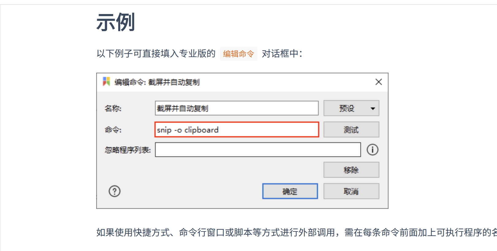

Welcome to my **first blog post** with the [LoveIt](https://hugoloveit.com) theme!

## 📌 Key Highlights

1. Markdown is **clean and fast**
2. LoveIt theme provides:
   - TOC support
   - Code highlighting
   - Image lightbox
3. Deployment via **GitHub Pages** is simple

---
